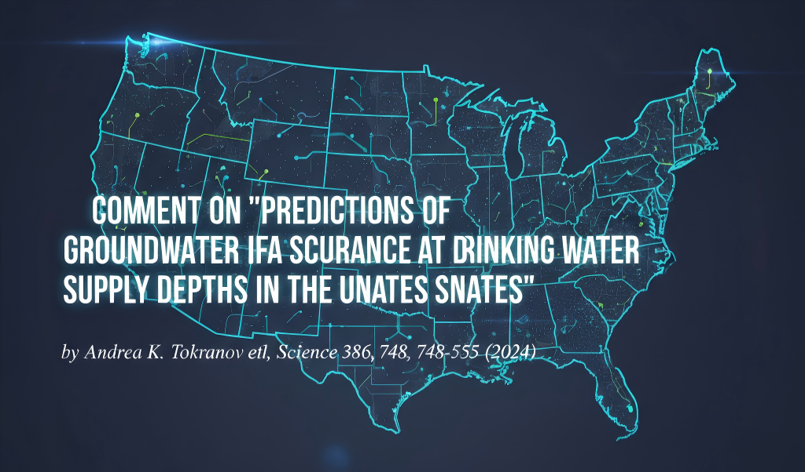
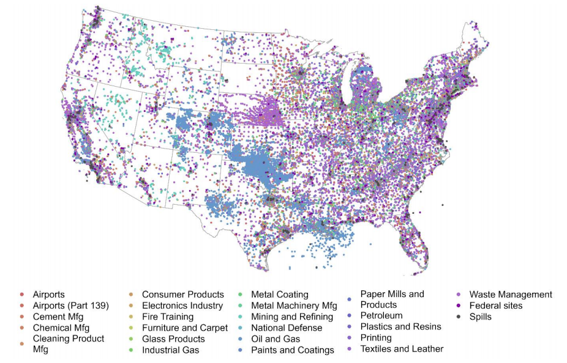
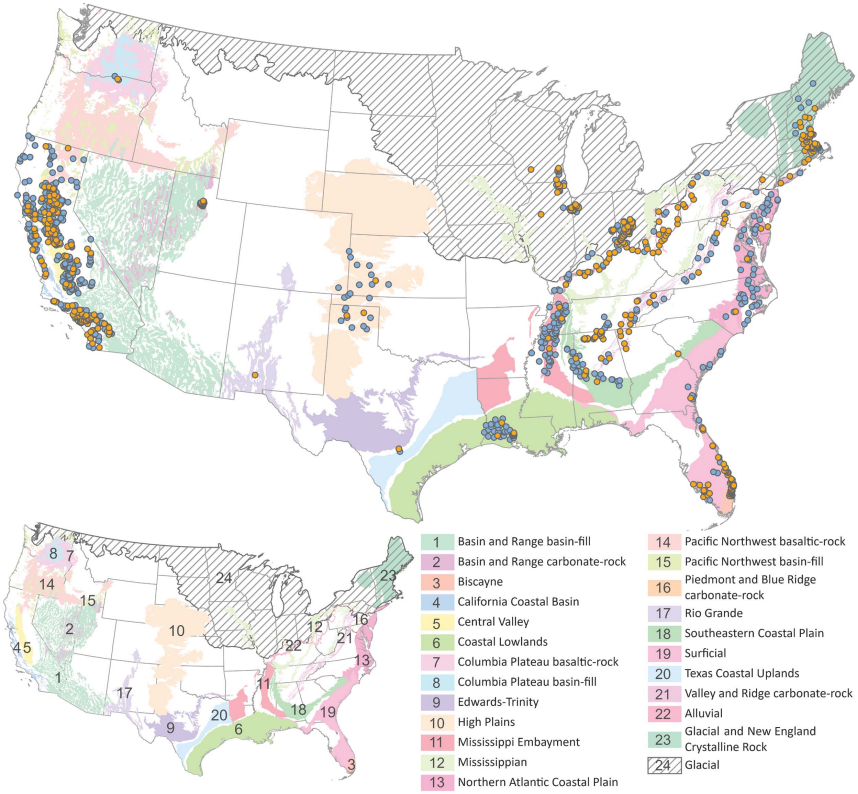
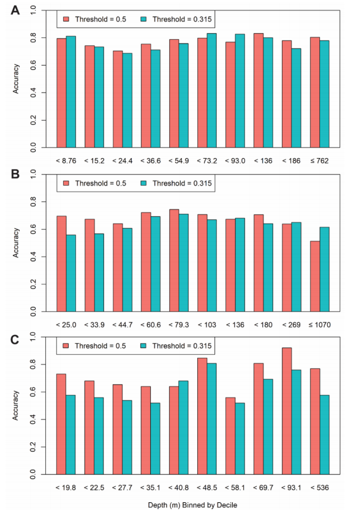
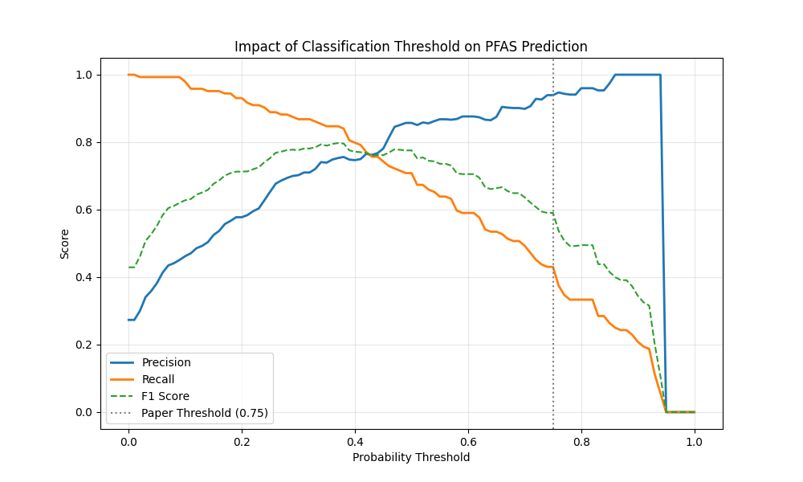

  
  <h1 align="center">Comment on"Predictions of groundwater PFAS occurrence at drinking water supply depths in the United States"by Andrea K. Tokranov et al, Science386,748-755(2024)</h1>

  <p align="center">Yuze Hao, Lan Duo</p>

  <p align="center">College of Chemistry and Chemical Engineering, Inner Mongolia University, Hohhot 010021, China.</p>

  <p align="center">In the paper titled 'Predictions of groundwater PFAS occurrence at drinking water supply depths in the United States' by Tokranov et al. (2024), the authors apply an XGBoost machine learning model to predict the occurrence of PFAS (per- and polyfluoroalkyl substances) in groundwater. The model uses a probability threshold of 0.315 to classify PFAS contamination levels, a key parameter for the model’s predictive capabilities. While the selection of a threshold is essential in model performance, the authors limit their validation to two threshold values—0.315 and 0.5. This comment seeks to critically examine this choice and its potential limitations. In this comment letter, we provide experiences about the best threshold setteling.</p>
  <p align="center"></p>


# Table of contents

- [Introduction](#Introduction)
- [experienment results](#experienment-results)
- [fast start](#fast-start)
- [Reference](#Reference)
- [Citation](#Citation)

# Introduction







# experienment results




# fast start

Clone this repo:

```bash
git clone https://github.com/YuzeHao2023/PFAS-ML.git
cd PFAS-ML
```

Install requirements:

```bash
pip3 install -r requirements.txt
```

and run experienments:

```bash
python3 src/main2.py
python3 main.py
```

and change the data path:

```python
DEFAULT_DATA_PATH = '/workspaces/PFAS-ML/data/science.ado6638_tables_s2_to_s5_and s9_to_s13.xlsx'
```

# Reference

[1] Tokranov, Andrea K., et al. "Predictions of groundwater PFAS occurrence at drinking water supply depths in the United States." Science 386.6723 (2024): 748-755.

# Citation

If this letter is helpful for you, please cite the following publication:

```bibtex
@article{hao2024comment,
  title={Comment on’predictions of groundwater pfas occurrence at drinking water supply depths in the united states’ by andrea k. tokranov et al., science 386, 748-755 (2024)},
  author={Hao, Yuze},
  journal={Science},
  volume={386},
  number={748-755},
  pages={2},
  year={2024}
}
```

